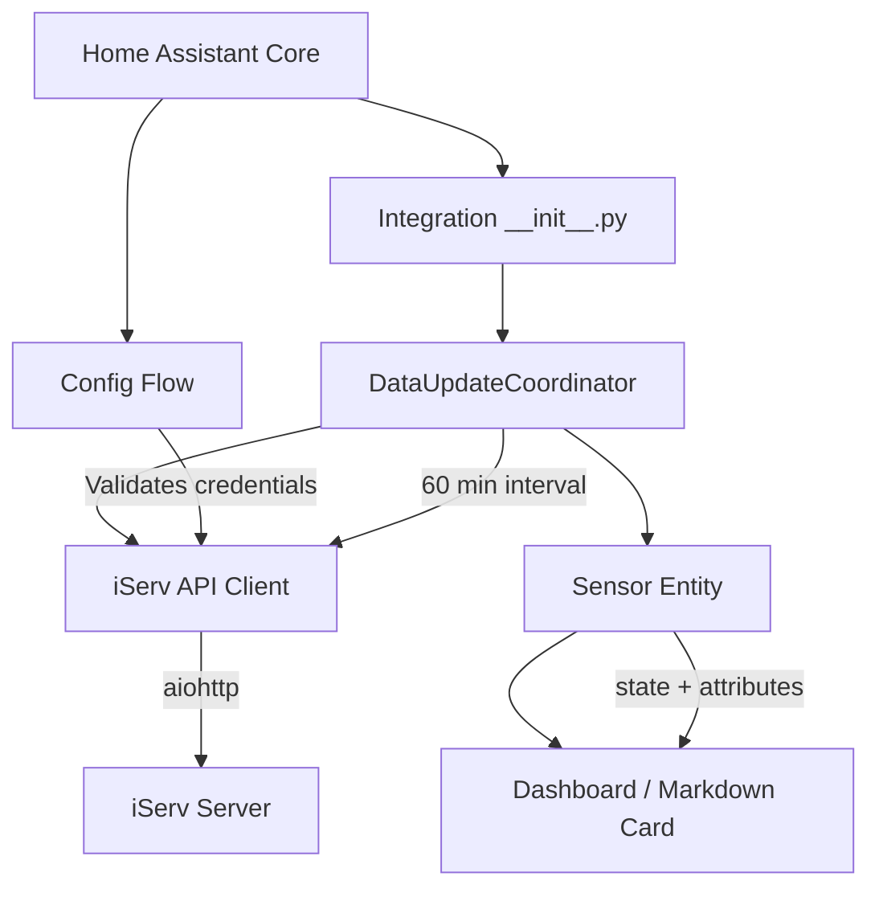

# Design Document: iServ Home Assistant Integration

## Overview

This integration connects Home Assistant to iServ (a school management platform) to fetch and display student timetable data. It follows Home Assistant's standard custom component architecture: a Config Flow for UI-based setup, a DataUpdateCoordinator for periodic data fetching, and a Sensor Entity to expose the timetable data.

The integration authenticates with iServ via session-based HTTP login (form POST), fetches the timetable for the current week, parses it into structured lesson objects, and exposes them through a sensor entity. The sensor state shows the next upcoming lesson, while attributes contain the full weekly schedule and a pre-formatted Markdown table for dashboard display.

**Key Design Decisions:**
- **aiohttp for HTTP**: Aligns with Home Assistant's async architecture and the declared dependency.
- **DataUpdateCoordinator**: Standard HA pattern for periodic polling with built-in error handling and caching.
- **Single sensor entity**: Keeps the integration lean. The full timetable lives in attributes; the state provides at-a-glance info.
- **Session-based auth with re-authentication**: iServ uses cookie-based sessions; the coordinator handles session expiry transparently.

## Architecture



**Data Flow:**
1. User configures credentials via Config Flow
2. Config Flow validates by attempting login via iServ API Client
3. On successful setup, the Coordinator starts periodic fetches (every 60 minutes)
4. The iServ API Client authenticates (if needed) and fetches timetable HTML/JSON
5. The Coordinator parses the response into structured lesson data
6. The Sensor Entity reads coordinator data and exposes state + attributes

## Components and Interfaces

### File Structure

```
custom_components/iserv/
├── __init__.py          # Integration setup, coordinator creation
├── manifest.json        # Integration metadata and dependencies
├── config_flow.py       # UI configuration flow
├── coordinator.py       # DataUpdateCoordinator subclass
├── sensor.py            # Sensor entity platform
├── api.py               # iServ HTTP client (login + timetable fetch)
├── parser.py            # Timetable HTML/JSON parsing logic
├── const.py             # Constants (domain, timeouts, defaults)
└── strings.json         # UI strings for config flow
```

### Component Interfaces

#### `const.py` — Constants

```python
DOMAIN = "iserv"
DEFAULT_UPDATE_INTERVAL = 60  # minutes
CONNECTION_TIMEOUT = 10  # seconds
REQUEST_TIMEOUT = 30  # seconds
MAX_CONSECUTIVE_FAILURES = 3
```

#### `api.py` — IServClient

```python
class IServClient:
    """Async HTTP client for iServ communication."""

    def __init__(self, session: aiohttp.ClientSession, base_url: str, username: str, password: str) -> None: ...

    async def authenticate(self) -> bool:
        """Login to iServ, store session cookies. Returns True on success."""
        ...

    async def fetch_timetable(self, week: int | None = None) -> str:
        """Fetch raw timetable data for a given calendar week. Returns raw response text."""
        ...

    @property
    def is_authenticated(self) -> bool:
        """Whether the client holds a valid session."""
        ...
```

#### `parser.py` — Timetable Parser

```python
@dataclass
class Lesson:
    day: str          # Localized weekday name ("Monday" / "Montag")
    start_time: str   # "HH:MM" format
    end_time: str     # "HH:MM" format
    subject: str      # Subject name or empty string
    room: str         # Room identifier or empty string

def parse_timetable(raw_data: str, locale: str) -> list[Lesson]:
    """Parse raw iServ timetable response into structured lesson objects."""
    ...

def sort_lessons(lessons: list[Lesson]) -> list[Lesson]:
    """Sort lessons by day (Mon-Fri) then by start_time ascending."""
    ...

def format_markdown_table(lessons: list[Lesson]) -> str:
    """Format lessons as a Markdown pipe-and-dash table string."""
    ...

def get_next_lesson(lessons: list[Lesson], now: datetime) -> Lesson | None:
    """Find the next upcoming lesson for the current day."""
    ...
```

#### `coordinator.py` — IServCoordinator

```python
class IServCoordinator(DataUpdateCoordinator[list[Lesson]]):
    """Coordinator to manage iServ timetable data fetching."""

    def __init__(self, hass: HomeAssistant, client: IServClient) -> None: ...

    async def _async_update_data(self) -> list[Lesson]:
        """Fetch and parse timetable. Handle auth expiry and retries."""
        ...
```

#### `sensor.py` — IServTimetableSensor

```python
class IServTimetableSensor(CoordinatorEntity[IServCoordinator], SensorEntity):
    """Sensor entity exposing timetable data."""

    @property
    def native_value(self) -> str:
        """Next upcoming lesson or 'No upcoming lessons' / 'No lessons' / 'Unavailable'."""
        ...

    @property
    def extra_state_attributes(self) -> dict[str, Any]:
        """Returns lessons list, timetable_table markdown, and last_updated timestamp."""
        ...
```

#### `config_flow.py` — ConfigFlow

```python
class IServConfigFlow(ConfigFlow, domain=DOMAIN):
    """Handle iServ integration configuration."""

    async def async_step_user(self, user_input: dict | None = None) -> FlowResult:
        """Handle user-initiated config. Validates URL format and credentials."""
        ...
```

#### `__init__.py` — Integration Setup

```python
async def async_setup_entry(hass: HomeAssistant, entry: ConfigEntry) -> bool:
    """Set up iServ from a config entry. Creates client, coordinator, forwards sensor platform."""
    ...

async def async_unload_entry(hass: HomeAssistant, entry: ConfigEntry) -> bool:
    """Unload iServ config entry."""
    ...
```

## Data Models

### Lesson Dataclass

```python
@dataclass
class Lesson:
    day: str          # Localized weekday name, e.g. "Monday" or "Montag"
    start_time: str   # 24h format "HH:MM", e.g. "08:30"
    end_time: str     # 24h format "HH:MM", e.g. "09:15"
    subject: str      # Subject name or "" if not assigned
    room: str         # Room identifier or "" if not assigned
```

### Config Entry Data

Stored securely via Home Assistant's config entry storage:

```python
{
    "url": "https://school.iserv.example",   # iServ server base URL
    "username": "student_username",           # iServ login username
    "password": "student_password"            # iServ login password
}
```

### Coordinator Data

The coordinator stores and returns `list[Lesson]` — a sorted list of all lessons for the current week.

### Sensor Entity Attributes

```python
{
    "lessons": [
        {"day": "Monday", "start_time": "08:00", "end_time": "08:45", "subject": "Math", "room": "A201"},
        {"day": "Monday", "start_time": "08:50", "end_time": "09:35", "subject": "English", "room": "B102"},
        # ... more lessons
    ],
    "timetable_table": "| Day | Time | Subject | Room |\n| --- | --- | --- | --- |\n| Monday | 08:00 - 08:45 | Math | A201 |\n...",
    "last_updated": "2024-01-15T10:30:00+01:00"
}
```

### Day Ordering

Days follow ISO weekday order for sorting:

```python
DAY_ORDER = {"Monday": 0, "Tuesday": 1, "Wednesday": 2, "Thursday": 3, "Friday": 4}
```

When localized names are used, the ordering maps locale-specific names to their ISO positions.

### State Values

| Condition | State Value |
|---|---|
| Next lesson exists today | `"{subject} {start_time}-{end_time}"` (max 255 chars) |
| No more lessons today | `"No upcoming lessons"` |
| Empty timetable for week | `"No lessons"` |
| Fetch failed, no prior data | `"Unavailable"` |


## Correctness Properties

*A property is a characteristic or behavior that should hold true across all valid executions of a system — essentially, a formal statement about what the system should do. Properties serve as the bridge between human-readable specifications and machine-verifiable correctness guarantees.*

### Property 1: URL Validation Correctness

*For any* string input to the URL validation function, the function SHALL accept the input if and only if it begins with "https://" and forms a syntactically valid URL (contains a host component). All other strings SHALL be rejected.

**Validates: Requirements 1.2**

### Property 2: Timetable Parsing Round-Trip

*For any* valid timetable data structure (a list of lessons with day, start_time, end_time, subject, and room), serializing it to the iServ response format and then parsing it back SHALL produce an equivalent list of Lesson objects where each object contains all five fields with correct values, times are in HH:MM 24-hour format, and missing subject/room fields default to empty strings.

**Validates: Requirements 2.3, 4.1, 4.3, 4.5, 4.6**

### Property 3: Lesson Sorting Invariant

*For any* list of Lesson objects, after applying the sort function, the resulting list SHALL satisfy: (a) lessons are ordered by day in Monday-through-Friday sequence, and (b) within each day, lessons are ordered by start_time in ascending chronological order.

**Validates: Requirements 4.2**

### Property 4: Next Lesson State Format

*For any* non-empty list of lessons and any current datetime, the sensor state value SHALL either be a string matching the format "{subject} {start_time}-{end_time}" not exceeding 255 characters (when an upcoming lesson exists for the current day), or the string "No upcoming lessons" (when no lessons remain for the current day).

**Validates: Requirements 3.2, 3.3**

### Property 5: Markdown Table Structure

*For any* non-empty list of Lesson objects, the formatted Markdown table string SHALL contain: a header row with columns "Day", "Time", "Subject", "Room" separated by pipes, a separator row using dashes, and one data row per lesson with Time formatted as "HH:MM - HH:MM", all using pipe-and-dash Markdown table syntax.

**Validates: Requirements 5.1, 5.2**

### Property 6: Data Retention on Fetch Failure

*For any* previously stored timetable data and any fetch failure event, the sensor entity SHALL retain all previously stored lesson data and attributes unchanged until a successful fetch occurs.

**Validates: Requirements 7.1**

### Property 7: Availability State Machine

*For any* sequence of fetch results (success or failure), the sensor entity availability SHALL be "unavailable" if and only if the last 3 or more consecutive results were failures. Any single success in the sequence SHALL reset the consecutive failure counter to zero and restore availability.

**Validates: Requirements 7.4, 7.5**

## Error Handling

### Authentication Errors

| Scenario | Behavior |
|---|---|
| Invalid credentials (HTTP 401/403) | Config Flow shows "Authentication failed" error, allows retry |
| Malformed URL (not https://) | Config Flow shows "Invalid URL" error before attempting connection |
| Connection timeout (>10s) | Config Flow shows "Cannot connect" error, allows retry |
| Connection refused | Config Flow shows "Cannot connect" error, allows retry |

### Runtime Fetch Errors

| Scenario | Behavior |
|---|---|
| Network error / timeout (>30s) | Coordinator logs warning, retains previous data, retries next interval |
| Session expired (HTTP 401 during fetch) | Coordinator re-authenticates once, retries fetch. On second failure: logs error, retries next interval |
| Consecutive failures < 3 | Log warning with failure count, entity remains available with stale data |
| Consecutive failures ≥ 3 | Entity marked unavailable, continues retry cycle |
| Success after unavailable | Counter resets to 0, entity restored to available |

### Data Parsing Errors

| Scenario | Behavior |
|---|---|
| Unexpected HTML/JSON structure | Coordinator raises `UpdateFailed`, treated as fetch failure |
| Missing fields in lesson data | Default to empty string for subject/room; skip lessons missing day/time |
| Invalid time format in response | Log warning, skip the malformed lesson entry |

### Graceful Degradation Strategy

The integration follows a "stale data is better than no data" principle:
- Previous timetable data is always preserved across failures
- The entity only becomes unavailable after 3 consecutive failures (roughly 3 hours of outage)
- Recovery is automatic — no user intervention needed

## Testing Strategy

### Testing Framework

- **pytest** as the test runner
- **pytest-aiohttp** for async test support
- **pytest-homeassistant-custom-component** for HA test fixtures (if available) or manual mocking of HA core classes
- **unittest.mock** / **aioresponses** for mocking aiohttp HTTP requests
- **hypothesis** for property-based testing

### Unit Tests (Example-Based)

Unit tests cover specific scenarios, edge cases, and integration points:

- **Config Flow tests**: Valid credentials → success; invalid credentials → auth error; unreachable URL → connection error; empty fields → form validation error
- **Coordinator lifecycle**: Verify 60-minute update interval; session re-authentication on expiry; logging on failures
- **Sensor entity edge cases**: Empty timetable → "No lessons" state; time after all lessons → "No upcoming lessons"; locale-specific day names
- **Parser edge cases**: Lessons with missing room/subject; malformed entries skipped; empty response

### Property-Based Tests

Property tests verify universal invariants using Hypothesis with minimum 100 iterations per property:

| Property | What's Generated | What's Verified |
|---|---|---|
| P1: URL Validation | Random strings, valid/invalid URLs | Only well-formed https:// URLs accepted |
| P2: Parsing Round-Trip | Random lesson structures | Serialize → parse produces equivalent data |
| P3: Sorting Invariant | Random unsorted lesson lists | Day order Mon-Fri, time order ascending |
| P4: Next Lesson State | Random lessons + datetimes | Format matches spec, ≤255 chars |
| P5: Markdown Table | Random lesson lists | Valid pipe-and-dash table with correct columns |
| P6: Data Retention | Random prior data + simulated failure | Data unchanged after failure |
| P7: Availability SM | Random success/failure sequences | Unavailable iff ≥3 consecutive failures |

**Configuration:**
- Each property test runs minimum 100 iterations
- Each test is tagged with: `# Feature: iserv-homeassistant-integration, Property {N}: {title}`
- Generators produce varied inputs including edge cases (empty strings, special characters, boundary times)

### Integration Tests

- Full setup flow: config entry creation → coordinator start → sensor entity exposure
- Mocked end-to-end: HTTP mock → coordinator fetch → sensor state update

### Test Organization

```
tests/
├── conftest.py          # Shared fixtures (mock client, sample data)
├── test_api.py          # IServClient unit tests
├── test_parser.py       # Parser unit + property tests
├── test_config_flow.py  # Config flow tests
├── test_coordinator.py  # Coordinator behavior tests
├── test_sensor.py       # Sensor entity tests
└── test_properties.py   # Property-based tests (all 7 properties)
```

### Running Tests

```bash
# Install dependencies
pip install pytest pytest-asyncio aioresponses hypothesis

# Run all tests
pytest

# Run only property tests
pytest tests/test_properties.py -v
```

No network access or running iServ instance required — all HTTP interactions are mocked.
