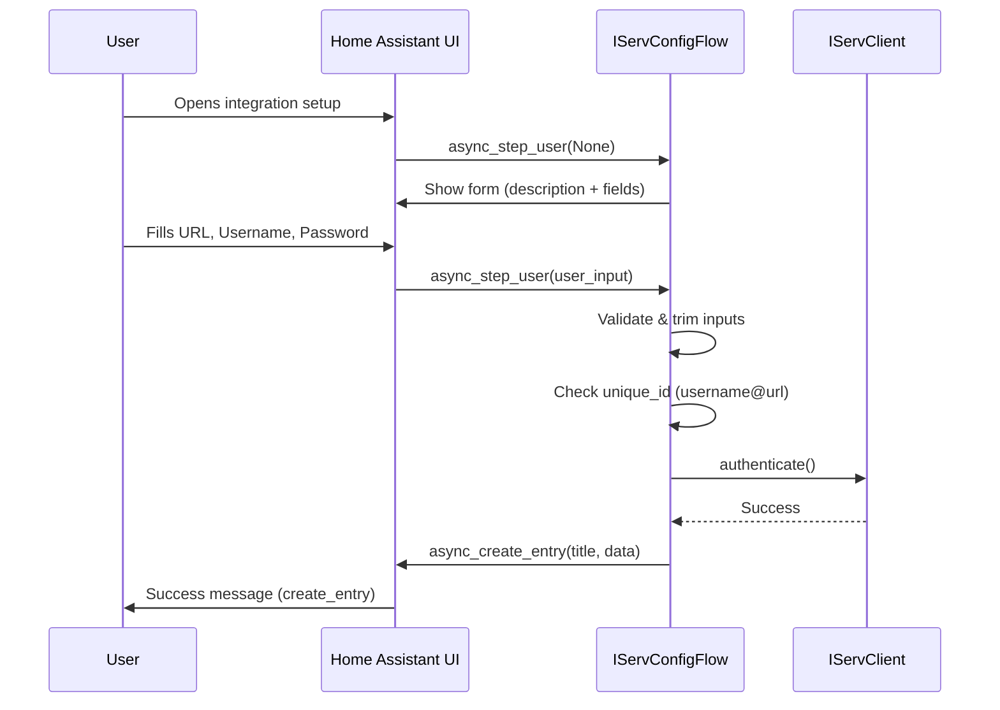

# Design Document: Setup Flow Improvements

## Overview

This feature updates the HAiServ integration's config flow to improve the user experience during setup. The changes are localized to two files:

1. **`strings.json`** — Add a welcome description, update field labels, and add a success message.
2. **`config_flow.py`** — Update the entry title format to include the URL and add duplicate-entry detection.

All changes are backward-compatible and do not affect the integration's runtime behavior beyond the setup wizard.

## Architecture

The config flow follows Home Assistant's standard `ConfigFlow` pattern:



No new architectural components are introduced. The changes modify existing behavior within the single `async_step_user` method and the `strings.json` localization file.

## Components and Interfaces

### Modified Components

| Component | File | Change |
|-----------|------|--------|
| Localization strings | `strings.json` | Add `description`, update `data` labels, add `create_entry` |
| Config flow logic | `config_flow.py` | Update title format, add `_abort_if_unique_id_configured` |

### strings.json Structure (after changes)

```json
{
  "config": {
    "step": {
      "user": {
        "title": "Connect to iServ",
        "description": "Welcome to HAiServ! ...",
        "data": {
          "url": "URL",
          "username": "Username",
          "password": "Password"
        }
      }
    },
    "error": { ... },
    "abort": { ... },
    "create_entry": {
      "default": "Successfully connected to {url}. Your credentials have been validated."
    }
  }
}
```

### config_flow.py Changes

1. **Title format**: Change from `iServ ({username})` to `iServ ({username} @ {url})`
2. **Unique ID**: Set `unique_id` to `{username}_{url}` (both trimmed) and call `self._abort_if_unique_id_configured()` before authentication to prevent duplicate entries.

## Data Models

No new data models are introduced. The existing config entry data structure remains unchanged:

```python
{
    "url": str,       # trimmed URL
    "username": str,  # trimmed username
    "password": str,  # password (not trimmed)
}
```

The `unique_id` for deduplication is derived as `f"{username}_{url}"` using the trimmed values.

## Error Handling

| Scenario | Behavior |
|----------|----------|
| Duplicate entry (same username + URL) | Flow aborts with `already_configured` message |
| Missing `create_entry` key in strings.json | Home Assistant falls back to its default success message (built-in behavior) |
| Validation errors (empty fields, bad URL, auth failure) | Unchanged — form re-displays with description still visible and error message shown |

The existing error handling in `config_flow.py` remains intact. The description text displays regardless of error state because it's defined at the step level in `strings.json`.

## Testing Strategy

### Why Property-Based Testing Does Not Apply

This feature consists of:
- Static text changes in a JSON localization file
- Simple string formatting (`f"iServ ({username} @ {url})"`)
- Standard Home Assistant `_abort_if_unique_id_configured()` call

There are no complex algorithms, parsers, data transformations, or large input spaces that would benefit from property-based testing. The logic is deterministic and trivial — unit tests with specific examples provide full coverage.

### Unit Tests

Unit tests should verify:

1. **Title format** — Given a username and URL, the created entry title matches `iServ ({username} @ {url})` with trimmed values.
2. **Duplicate detection** — When a config entry already exists with the same username/URL combination, the flow aborts with `already_configured`.
3. **strings.json structure** — The JSON file contains the required keys: `config.step.user.description`, `config.step.user.data.url` = "URL", `config.step.user.data.username` = "Username", `config.step.user.data.password` = "Password", and `config.create_entry.default`.
4. **Description persistence on error** — When the form is re-shown after a validation error, the description field is still present (guaranteed by HA's form rendering when the key exists in strings.json).

### Integration Tests

1. **Full flow happy path** — Mock `IServClient.authenticate()`, submit valid credentials, verify the entry is created with correct title and data.
2. **Full flow with duplicate** — Set up an existing entry, attempt to add the same username+URL, verify abort.

### Test Framework

Use `pytest` with `pytest-homeassistant-custom-component` for config flow testing, consistent with the existing project setup (`.hypothesis` directory and `pytest.ini`/`pyproject.toml` already present).
